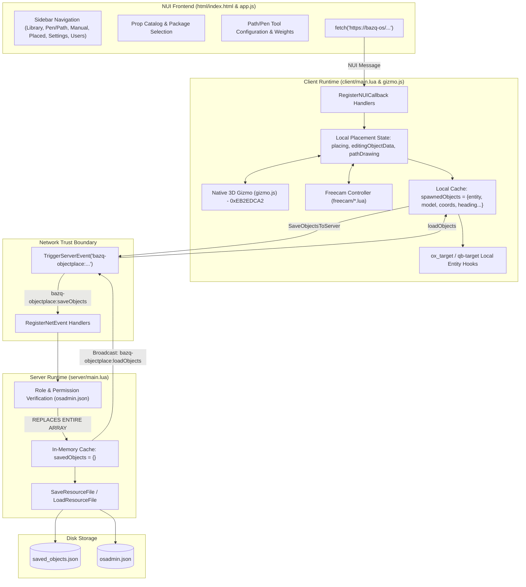
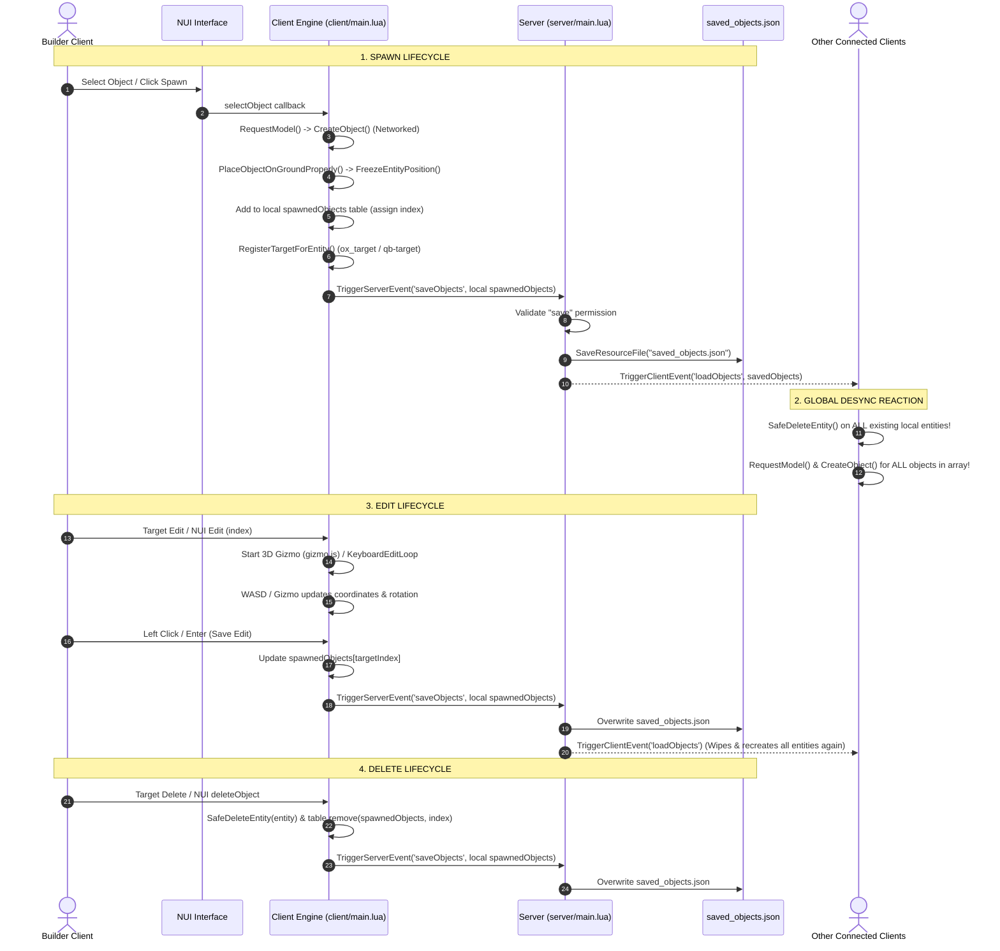
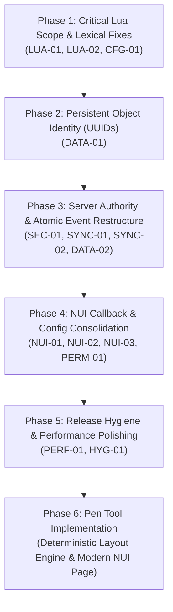

# bazq-os Comprehensive Source Code Audit & Technical Architecture Report

**Resource:** `bazq-os` (Version 2.4.0)  
**Author:** `bazq`  
**Date of Audit:** October 2026  
**Auditor:** Antigravity (Advanced Agentic Analysis)  
**Scope:** Complete static code analysis of active runtime files defined in [fxmanifest.lua](file:///d:/bazq/basez/txData/Qbox_4AEC51.base/resources/[bazq]/bazq-os/fxmanifest.lua) and system boundaries.

---

## Executive Summary

`bazq-os` is a comprehensive FiveM object placement, editing, library, and world-building suite developed by **bazq**. It also functions as the authorized placement gateway for escrow-protected prop packages.

The codebase has evolved through multiple iterations, incorporating sophisticated subsystems (interactive 3D native gizmos, dynamic freecam with interior pinning, raycasting, ground-normal matrix alignment, target system integrations with `ox_target` and `qb-target`, and user/role permission hierarchies). 

However, because multiple development generations and AI-generated iterations have accumulated, the system currently suffers from **severe client/server trust inversion**, **state synchronization vulnerabilities (lost updates and global entity recreation on save)**, **lexical scope / initialization order bugs that cause runtime nil-crashes**, **unstable object identity (lack of persistent UUIDs)**, **duplicate/dead NUI callbacks**, and **config desynchronization across 5 separate locations**.

This audit provides a complete, defensive analysis of the primary truth—the active source code—and lays out a clear, dependency-aware architectural remediation path before the new **Pen Tool** feature is implemented.

---

## Table of Contents

1. [Runtime Architecture & File Manifest](#1-runtime-architecture--file-manifest)
2. [Audit Findings Summary Matrix](#2-audit-findings-summary-matrix)
3. [Detailed Audit Findings](#3-detailed-audit-findings)
   - [Critical & High Severity Findings](#critical--high-severity-findings)
   - [Medium Severity Findings](#medium-severity-findings)
   - [Low & Cleanup Findings](#low--cleanup-findings)
   - [Runtime Verification Items](#runtime-verification-items)
4. [Architecture Map](#4-architecture-map)
5. [Trust Boundary & Network Security Map](#5-trust-boundary--network-security-map)
6. [Permission Matrix (Source vs Claimed)](#6-permission-matrix-source-vs-claimed)
7. [Object Lifecycle Map](#7-object-lifecycle-map)
8. [Persistence Architecture & Failure Analysis](#8-persistence-architecture--failure-analysis)
9. [Performance & Tick/Resmon Profile](#9-performance--tickresmon-profile)
10. [NUI Subsystem & Contract Evaluation](#10-nui-subsystem--contract-evaluation)
11. [Path Creator → Pen Tool Assessment](#11-path-creator--pen-tool-assessment)
12. [Repository & Release Hygiene](#12-repository--release-hygiene)
13. [Recommended Implementation Order](#13-recommended-implementation-order)

---

## 1. Runtime Architecture & File Manifest

According to [fxmanifest.lua](file:///d:/bazq/basez/txData/Qbox_4AEC51.base/resources/[bazq]/bazq-os/fxmanifest.lua), the active runtime consists strictly of:

| Manifest Section | Loaded Files | Role in System |
| :--- | :--- | :--- |
| `shared_scripts` | [shared/config.lua](file:///d:/bazq/basez/txData/Qbox_4AEC51.base/resources/[bazq]/bazq-os/shared/config.lua)<br>[shared/locales.lua](file:///d:/bazq/basez/txData/Qbox_4AEC51.base/resources/[bazq]/bazq-os/shared/locales.lua) | Global settings, locale dictionary `L()`, TestZone coords, Path Creator configs |
| `client_scripts` | [freecam/utils.lua](file:///d:/bazq/basez/txData/Qbox_4AEC51.base/resources/[bazq]/bazq-os/freecam/utils.lua)<br>[freecam/config.lua](file:///d:/bazq/basez/txData/Qbox_4AEC51.base/resources/[bazq]/bazq-os/freecam/config.lua)<br>[freecam/camera.lua](file:///d:/bazq/basez/txData/Qbox_4AEC51.base/resources/[bazq]/bazq-os/freecam/camera.lua)<br>[freecam/main.lua](file:///d:/bazq/basez/txData/Qbox_4AEC51.base/resources/[bazq]/bazq-os/freecam/main.lua)<br>[client/gizmo.js](file:///d:/bazq/basez/txData/Qbox_4AEC51.base/resources/[bazq]/bazq-os/client/gizmo.js)<br>[client/main.lua](file:///d:/bazq/basez/txData/Qbox_4AEC51.base/resources/[bazq]/bazq-os/client/main.lua) | Freecam math & controls, native DrawGizmo JS bridge, NUI communication, raycasting, placement, target hooks |
| `server_scripts` | [server/main.lua](file:///d:/bazq/basez/txData/Qbox_4AEC51.base/resources/[bazq]/bazq-os/server/main.lua) | Persistence to `saved_objects.json`, `osadmin.json` user management, net events |
| `ui_page` | [html/index.html](file:///d:/bazq/basez/txData/Qbox_4AEC51.base/resources/[bazq]/bazq-os/html/index.html) | Root NUI view |
| `files` | `html/index.html`, `html/app.js`, `html/style.css`, `html/images/*.png`, `html/*.ttf`, `objects_config.json` | Web assets, font files, package definitions |

**Excluded / Dormant Directories:**
- `dolu_tool-main/`: Completely excluded from manifest. Reference project only.
- `referance/`: Contains reference `bazq-obs_ext.ymap.xml`. Not loaded.
- `client.zip`: 4.8MB archive in root.
- `json2ymap.py`: Standalone Python Tkinter desktop converter. Not part of FiveM server runtime.
- `yeni update.txt`: Unused informal scratch notes.

---

## 2. Audit Findings Summary Matrix

| Finding ID | Severity | File & Location | Core Problem | Runtime Verify |
| :--- | :--- | :--- | :--- | :---: |
| **SEC-01** | **CRITICAL** | [server/main.lua#L1040-L1094](file:///d:/bazq/basez/txData/Qbox_4AEC51.base/resources/[bazq]/bazq-os/server/main.lua#L1040-L1094) | Blind client-to-server array overwrite (`savedObjects = objectsDataFromClient`) | No |
| **LUA-01** | **CRITICAL** | [server/main.lua#L49-L92](file:///d:/bazq/basez/txData/Qbox_4AEC51.base/resources/[bazq]/bazq-os/server/main.lua#L49-L92) | `playerDropped` accesses `savedObjects` & `SaveObjectsToFile` before lexical declaration | No |
| **LUA-02** | **HIGH** | [client/main.lua#L212-L215](file:///d:/bazq/basez/txData/Qbox_4AEC51.base/resources/[bazq]/bazq-os/client/main.lua#L212-L215), [L582](file:///d:/bazq/basez/txData/Qbox_4AEC51.base/resources/[bazq]/bazq-os/client/main.lua#L582), [L606](file:///d:/bazq/basez/txData/Qbox_4AEC51.base/resources/[bazq]/bazq-os/client/main.lua#L606) | `StartTargetDuplicate` & `ConvertToGate` index `currentPlacementOptions` before declaration | No |
| **SYNC-01** | **HIGH** | [client/main.lua#L3163-L3210](file:///d:/bazq/basez/txData/Qbox_4AEC51.base/resources/[bazq]/bazq-os/client/main.lua#L3163-L3210) | Global entity destruction & respawn on every single save broadcast | Yes |
| **SYNC-02** | **HIGH** | [server/main.lua#L1069](file:///d:/bazq/basez/txData/Qbox_4AEC51.base/resources/[bazq]/bazq-os/server/main.lua#L1069), [client/main.lua#L3117](file:///d:/bazq/basez/txData/Qbox_4AEC51.base/resources/[bazq]/bazq-os/client/main.lua#L3117) | Multi-builder race conditions & permanent lost updates | No |
| **DATA-01** | **HIGH** | [saved_objects.json](file:///d:/bazq/basez/txData/Qbox_4AEC51.base/resources/[bazq]/bazq-os/saved_objects.json), [client/main.lua#L2646](file:///d:/bazq/basez/txData/Qbox_4AEC51.base/resources/[bazq]/bazq-os/client/main.lua#L2646) | Absence of persistent unique object UUIDs | No |
| **NUI-01** | **HIGH** | [client/main.lua#L1320](file:///d:/bazq/basez/txData/Qbox_4AEC51.base/resources/[bazq]/bazq-os/client/main.lua#L1320), [L3446](file:///d:/bazq/basez/txData/Qbox_4AEC51.base/resources/[bazq]/bazq-os/client/main.lua#L3446) | Duplicate `reopenMenu` callback registrations clobber permission checks | No |
| **PATH-01** | **HIGH** | [client/main.lua#L4035](file:///d:/bazq/basez/txData/Qbox_4AEC51.base/resources/[bazq]/bazq-os/client/main.lua#L4035), [L3586](file:///d:/bazq/basez/txData/Qbox_4AEC51.base/resources/[bazq]/bazq-os/client/main.lua#L3586) | Path Creator preview vs final placement randomization divergence | No |
| **DATA-02** | **MEDIUM** | [server/main.lua#L115-L130](file:///d:/bazq/basez/txData/Qbox_4AEC51.base/resources/[bazq]/bazq-os/server/main.lua#L115-L130), [L322](file:///d:/bazq/basez/txData/Qbox_4AEC51.base/resources/[bazq]/bazq-os/server/main.lua#L322) | Non-atomic file persistence with total cache wipe on decode failure | Yes |
| **PATH-02** | **MEDIUM** | [shared/config.lua#L90-L112](file:///d:/bazq/basez/txData/Qbox_4AEC51.base/resources/[bazq]/bazq-os/shared/config.lua#L90-L112), [client/main.lua#L3646](file:///d:/bazq/basez/txData/Qbox_4AEC51.base/resources/[bazq]/bazq-os/client/main.lua#L3646) | Hardcoded/incomplete prop width definitions causing gaps and overlap | No |
| **NUI-02** | **MEDIUM** | [html/app.js#L1705](file:///d:/bazq/basez/txData/Qbox_4AEC51.base/resources/[bazq]/bazq-os/html/app.js#L1705), [client/main.lua#L4493](file:///d:/bazq/basez/txData/Qbox_4AEC51.base/resources/[bazq]/bazq-os/client/main.lua#L4493), [L1250](file:///d:/bazq/basez/txData/Qbox_4AEC51.base/resources/[bazq]/bazq-os/client/main.lua#L1250) | Dead NUI callbacks (`ready`, `gateDialogResponse`, `editObject`, `cleanupPreviews`) | No |
| **NUI-03** | **MEDIUM** | [html/app.js#L1204-L1229](file:///d:/bazq/basez/txData/Qbox_4AEC51.base/resources/[bazq]/bazq-os/html/app.js#L1204-L1229), [html/index.html#L128](file:///d:/bazq/basez/txData/Qbox_4AEC51.base/resources/[bazq]/bazq-os/html/index.html#L128) | Package configurations quintupled across Lua, HTML, and JS | No |
| **PERF-01** | **MEDIUM** | [client/main.lua#L4668-L4675](file:///d:/bazq/basez/txData/Qbox_4AEC51.base/resources/[bazq]/bazq-os/client/main.lua#L4668-L4675), [L1643-L1646](file:///d:/bazq/basez/txData/Qbox_4AEC51.base/resources/[bazq]/bazq-os/client/main.lua#L1643-L1646) | TestZone thread 0ms tick loop structure & blocking F6 permission wait | No |
| **CFG-01** | **MEDIUM** | [client/main.lua#L4544-L4578](file:///d:/bazq/basez/txData/Qbox_4AEC51.base/resources/[bazq]/bazq-os/client/main.lua#L4544-L4578) | Dynamic attempt to load non-existent `debug_config.lua` ignores `Config.TestZone` | No |
| **PERM-01** | **MEDIUM** | [server/main.lua#L517-L524](file:///d:/bazq/basez/txData/Qbox_4AEC51.base/resources/[bazq]/bazq-os/server/main.lua#L517-L524), [L1192-L1224](file:///d:/bazq/basez/txData/Qbox_4AEC51.base/resources/[bazq]/bazq-os/server/main.lua#L1192-L1224) | ACE fallback ignored for F7/F6 checks; restricted strictly to `osadmin.json` | No |
| **HYG-01** | **CLEANUP** | Workspace Root | Shipped debug commands, root archives (`client.zip`), reference directories | No |

---

## 3. Detailed Audit Findings

### Critical & High Severity Findings

#### [SEC-01] Blind Client-to-Server Full Array Overwrite in `saveObjects`
- **Severity:** CRITICAL
- **File & Function:** [server/main.lua#L1040-L1094](file:///d:/bazq/basez/txData/Qbox_4AEC51.base/resources/[bazq]/bazq-os/server/main.lua#L1040-L1094) (`bazq-objectplace:saveObjects`)
- **Actual Source Behavior:**
  When a client triggers `bazq-objectplace:saveObjects`, the server validates that the player has the `"save"` permission. However, once that check passes, the server does:
  ```lua
  savedObjects = objectsDataFromClient
  SaveObjectsToFile()
  for _, player in ipairs(GetPlayers()) do
      if tonumber(player) ~= src then
          TriggerClientEvent("bazq-objectplace:loadObjects", player, savedObjects)
      end
  end
  ```
  The server performs zero validation on the elements inside `objectsDataFromClient`. It verifies neither the array size, nor coordinate bounds, nor model hashes, nor ownership of individual elements. It accepts the client's table as the new global database and persists it to disk.
- **Why It Is a Problem:**
  This inverts the client/server trust boundary completely. A client should never be the authority on the global state of the world. Any authenticated mapper can completely delete all objects created by all other mappers simply by passing an array without those objects. Furthermore, a rogue or modified client can inject hundreds of invalid or malicious props, alter coordinates of objects placed by owners, or spoof metadata.
- **Concrete Failure Scenario:**
  Mapper A has placed 200 walls over 2 hours. Mapper B opens the tool, but due to network latency, Mapper B's client loaded only 180 objects. Mapper B moves a trash can and clicks Save. Mapper B's client sends its local array of 180 objects to the server. The server replaces `savedObjects` with Mapper B's 180 objects. The 20 objects placed by Mapper A are permanently deleted from `saved_objects.json` without warning or recovery.
- **Recommended Architectural Fix:**
  Transition from monolithic array replacement to **atomic, granular CRUD events**:
  - `bazq-os:server:placeObject(objectData)`
  - `bazq-os:server:updateObject(id, transformData)`
  - `bazq-os:server:deleteObject(id)`
  - `bazq-os:server:batchPlaceObjects(objectsArray)`
  The server must maintain authoritative state, validate inputs (whitelisted models, reasonable coordinate bounds), assign a server-generated UUID to each object, and broadcast only delta updates (`objectAdded`, `objectUpdated`, `objectRemoved`).
- **Runtime Verification Required:** No (confirmed by direct code inspection).

---

#### [LUA-01] Lexical Scope Resolution Error in `playerDropped` Event Handler
- **Severity:** CRITICAL
- **File & Function:** [server/main.lua#L49-L92](file:///d:/bazq/basez/txData/Qbox_4AEC51.base/resources/[bazq]/bazq-os/server/main.lua#L49-L92) (`playerDropped`)
- **Actual Source Behavior:**
  In Lua, local variables and local functions must be declared before they are referenced; otherwise, Lua resolves the identifiers in the global environment (`_ENV` / `_G`).
  In [server/main.lua](file:///d:/bazq/basez/txData/Qbox_4AEC51.base/resources/[bazq]/bazq-os/server/main.lua):
  - Line 49 registers `AddEventHandler('playerDropped', function(reason) ...)`
  - Line 63 references `#savedObjects`
  - Line 79 calls `SaveObjectsToFile()`
  - Line 109 declares `local savedObjects = {}`
  - Line 299 declares `local function SaveObjectsToFile()`
- **Why It Is a Problem:**
  Because `savedObjects` and `SaveObjectsToFile` are declared as *locals* later in the file, the anonymous function compiled at line 49 resolves them as `_G.savedObjects` and `_G.SaveObjectsToFile`. Both are `nil`.
- **Concrete Failure Scenario:**
  A server administrator enables `Config.TestZone.enabled = true` and `Config.TestZone.cleanupOnDisconnect = true`. A player joins, places an object in the TestZone, and disconnects. The `playerDropped` event fires. Line 63 executes:
  ```lua
  for i = #savedObjects, 1, -1 do
  ```
  Because `_G.savedObjects` is nil, Lua throws: `attempt to get length of a nil value (global 'savedObjects')`. The server console logs a script error, the cleanup loop aborts, the player's tracked objects are not removed, and `SaveObjectsToFile()` is never reached.
- **Recommended Architectural Fix:**
  Move all top-level state declarations (`savedObjects`, `osAdminData`, `playerPlacedObjects`) and helper functions to the top of [server/main.lua](file:///d:/bazq/basez/txData/Qbox_4AEC51.base/resources/[bazq]/bazq-os/server/main.lua), before registering any event handlers.
- **Runtime Verification Required:** No.

---

#### [LUA-02] Premature Global Access to `currentPlacementOptions` on Client
- **Severity:** HIGH
- **File & Function:** [client/main.lua#L212](file:///d:/bazq/basez/txData/Qbox_4AEC51.base/resources/[bazq]/bazq-os/client/main.lua#L212) (`StartTargetDuplicate`), [L582](file:///d:/bazq/basez/txData/Qbox_4AEC51.base/resources/[bazq]/bazq-os/client/main.lua#L582) (`ConvertToGate`), [L606](file:///d:/bazq/basez/txData/Qbox_4AEC51.base/resources/[bazq]/bazq-os/client/main.lua#L606) (Declaration)
- **Actual Source Behavior:**
  - Line 212 in `StartTargetDuplicate`: `local playerName = currentPlacementOptions.playerName or "Unknown"`
  - Line 582 in `ConvertToGate`: `playerName = currentPlacementOptions.playerName or "Unknown"`
  - Line 606: `local currentPlacementOptions = { snapToGround = true, ... }`
- **Why It Is a Problem:**
  Identical to [LUA-01], lines 212 and 582 resolve `currentPlacementOptions` as `_G.currentPlacementOptions`. Because no global variable by that name exists, `currentPlacementOptions` evaluates to `nil`. Attempting to index `.playerName` results in an immediate Lua runtime exception: `attempt to index a nil value (global 'currentPlacementOptions')`.
- **Concrete Failure Scenario:**
  A player targets an existing placed prop using `ox_target` and clicks "Duplicate Object" or "Convert to Gate". The script throws a fatal error in the client console: `client/main.lua:212: attempt to index a nil value (global 'currentPlacementOptions')`. The duplication or gate conversion halts abruptly and the entity is left in an inconsistent state.
- **Recommended Architectural Fix:**
  Hoist the declaration of `currentPlacementOptions` to the state initialization block at lines 58-75 in [client/main.lua](file:///d:/bazq/basez/txData/Qbox_4AEC51.base/resources/[bazq]/bazq-os/client/main.lua).
- **Runtime Verification Required:** No.

---

#### [SYNC-01] Global Entity Destruction & Recreation on Every Save Sync
- **Severity:** HIGH
- **File & Function:** [client/main.lua#L3163-L3210](file:///d:/bazq/basez/txData/Qbox_4AEC51.base/resources/[bazq]/bazq-os/client/main.lua#L3163-L3210) (`bazq-objectplace:loadObjects`)
- **Actual Source Behavior:**
  Whenever any player saves, the server broadcasts `bazq-objectplace:loadObjects` with the entire database to all connected clients. Upon receiving this event:
  ```lua
  for _, oD in ipairs(spawnedObjects) do
      if oD.entity and DoesEntityExist(oD.entity) then
          SafeDeleteEntity(oD.entity)
      end
      if oD.interiorEntity then ... SafeDeleteEntity(...) end
  end
  spawnedObjects = {}
  -- Loop through all objects and call CreateObject() for every single one
  ```
- **Why It Is a Problem:**
  If a server has 800 placed objects and 5 mappers working simultaneously:
  1. Every single time any mapper clicks "Save", places a wall, or duplicates an object, **all 800 entities are deleted from GTA world memory and recreated from scratch** for all players.
  2. This produces severe frame drops (resmon spikes), model streaming hitching (`RequestModel` / `HasModelLoaded` loops), and visible object flashing.
  3. If another mapper was currently holding or editing an entity (`editingObjectData.entity`), their target entity handle is deleted from under them by the incoming sync loop!
- **Concrete Failure Scenario:**
  Builder A is fine-tuning the rotation of a decorative gate using the 3D Gizmo. Builder B places a road sign 2 kilometers away and hits Save. Builder A's screen flashes as all local objects despawn and respawn. The gate entity Builder A was editing is deleted and replaced with a new entity handle. Builder A's gizmo becomes invalid, and saving their edit fails with `"Object was displaced or deleted from the server while editing! Data desync."`
- **Recommended Architectural Fix:**
  Implement delta-based entity synchronization:
  - When an object is added: broadcast `objectCreated`, spawn only that entity.
  - When an object is modified: broadcast `objectUpdated`, update entity coordinates/heading in place without recreating it.
  - When an object is deleted: broadcast `objectDeleted`, delete only that entity.
- **Runtime Verification Required:** Yes (observe entity handle changes and FPS impact during multi-client sync).

---

#### [SYNC-02] Multi-Builder State Overwrites and Lost Updates
- **Severity:** HIGH
- **File & Function:** [server/main.lua#L1069](file:///d:/bazq/basez/txData/Qbox_4AEC51.base/resources/[bazq]/bazq-os/server/main.lua#L1069), [client/main.lua#L3117-L3160](file:///d:/bazq/basez/txData/Qbox_4AEC51.base/resources/[bazq]/bazq-os/client/main.lua#L3117-L3160)
- **Actual Source Behavior:**
  Because the client gathers all locally spawned objects and sends the entire array to the server via `SaveObjectsToServer()`, the server operates under a **"last writer replaces everything"** paradigm.
- **Why It Is a Problem:**
  There is no concurrency control, versioning, or locking. If two builders work in different zones of the map at the same time, their changes collide destructively.
- **Concrete Failure Scenario:**
  1. Server starts with objects [1..50].
  2. Mapper A spawns object 51 (local list: [1..51]).
  3. Mapper B spawns object 52 before receiving Mapper A's update (local list: [1..50, 52]).
  4. Mapper B saves first: server writes [1..50, 52].
  5. Mapper A saves second: server writes [1..51].
  6. Object 52 placed by Mapper B is completely eradicated from disk and server memory.
- **Recommended Architectural Fix:**
  Server-authoritative state store where client requests additions, modifications, and deletions by ID rather than transmitting the complete collection.
- **Runtime Verification Required:** No.

---

#### [DATA-01] Absence of Persistent Unique Object Identifiers (UUIDs)
- **Severity:** HIGH
- **File & Function:** [saved_objects.json](file:///d:/bazq/basez/txData/Qbox_4AEC51.base/resources/[bazq]/bazq-os/saved_objects.json), [client/main.lua#L2646-L2657](file:///d:/bazq/basez/txData/Qbox_4AEC51.base/resources/[bazq]/bazq-os/client/main.lua#L2646-L2657), [L1067-L1135](file:///d:/bazq/basez/txData/Qbox_4AEC51.base/resources/[bazq]/bazq-os/client/main.lua#L1067-L1135)
- **Actual Source Behavior:**
  In `saved_objects.json`, objects are stored as:
  ```json
  {
    "playerName": "bazq",
    "coords": { "x": -1422.08, "y": 5087.40, "z": 60.11 },
    "rotation": { "x": 0.0, "y": -0.0, "z": 150.99 },
    "model": "prop_bin_08open",
    "heading": 150.99,
    "timestamp": 1784568188
  }
  ```
  There is no `id`, `uuid`, or persistent index. Objects are referenced across the entire client, server, and NUI by their numerical array index (`data.index`). When array indices shift due to deletion, the client attempts a fallback search:
  ```lua
  if obj.timestamp == editingObjectData.timestamp and 
     obj.playerName == editingObjectData.playerName and 
     obj.model == editingObjectData.model then ...
  ```
- **Why It Is a Problem:**
  Array indices are inherently unstable in dynamic lists. If two props of the same model are spawned within the same second by the same player (common during automated path generation or rapid duplication):
  1. They have identical `playerName`, `model`, and `timestamp`.
  2. The fallback lookup matches whichever object occurs first in the array.
  3. When deleting or editing via NUI or target, operations apply to the wrong object.
  4. In `server/main.lua`, TestZone disconnect cleanup matches objects using fuzzy coordinate comparisons (`math.abs(x1 - x2) < 0.1`), which can misidentify closely packed props.
- **Recommended Architectural Fix:**
  Generate a persistent `uuid` (e.g. `uuid4` string or monotonic snowflake ID `id = "bazq_obj_" .. GetGameTimer() .. "_" .. math.random(1000, 9999)`) upon creation. Store this `id` in `saved_objects.json`, `spawnedObjects`, and pass it through all NUI and network events.
- **Runtime Verification Required:** No.

---

#### [NUI-01] Duplicate `reopenMenu` Callback Registration Overwriting Logic
- **Severity:** HIGH
- **File & Function:** [client/main.lua#L1320-L1332](file:///d:/bazq/basez/txData/Qbox_4AEC51.base/resources/[bazq]/bazq-os/client/main.lua#L1320-L1332) & [client/main.lua#L3446-L3458](file:///d:/bazq/basez/txData/Qbox_4AEC51.base/resources/[bazq]/bazq-os/client/main.lua#L3446-L3458)
- **Actual Source Behavior:**
  `RegisterNUICallback('reopenMenu', ...)` is defined twice in [client/main.lua](file:///d:/bazq/basez/txData/Qbox_4AEC51.base/resources/[bazq]/bazq-os/client/main.lua):
  - **First instance (Line 1320):**
    ```lua
    RegisterNUICallback('reopenMenu', function(data, cb)
        if not isFreecamActive then
            if debugConfig and debugConfig.testZone and debugConfig.testZone.enabled and IsPlayerInTestZone() then
                TriggerEvent("bazq-objectplace:adminCheckResponse", {hasAccess = true, ...})
            else
                TriggerServerEvent("bazq-objectplace:checkAdminPermission")
            end
        end
        cb('ok')
    end)
    ```
  - **Second instance (Line 3446):**
    ```lua
    RegisterNUICallback('reopenMenu', function(data, cb)
        if not placing and not editingObjectData and not isMenuOpen and not pathDrawing then
            SetNuiFocus(true, true)
            isMenuOpen = true
            OpenNUIMenu()
        end
        cb({status = 'ok'})
    end)
    ```
- **Why It Is a Problem:**
  In FiveM's Lua runtime, registering an NUI callback with the same name replaces the previous handler. The second handler (line 3446) completely clobbers the first (line 1320). As a result:
  1. The permission check `checkAdminPermission` is never triggered when reopening the menu.
  2. The freecam check `if not isFreecamActive` is eliminated, allowing the menu to open over freecam improperly.
- **Concrete Failure Scenario:**
  A player with expired permissions or a guest whose role was revoked reopens the menu from NUI. Because the second callback bypasses `checkAdminPermission` and calls `OpenNUIMenu()` directly, the client-side UI reopens without server authorization.
- **Recommended Architectural Fix:**
  Consolidate into a single callback with distinct names or unified state verification: ensure any menu reopening passes through server permission validation unless an active session token is valid.
- **Runtime Verification Required:** No.

---

#### [PATH-01] Path Creator Preview vs Final Placement Randomization Divergence
- **Severity:** HIGH
- **File & Function:** [client/main.lua#L4035-L4076](file:///d:/bazq/basez/txData/Qbox_4AEC51.base/resources/[bazq]/bazq-os/client/main.lua#L4035-L4076) (`StartPathDrawingLoop`), [client/main.lua#L3586-L3650](file:///d:/bazq/basez/txData/Qbox_4AEC51.base/resources/[bazq]/bazq-os/client/main.lua#L3586-L3650) (`BuildPathProps`)
- **Actual Source Behavior:**
  - During live preview in `StartPathDrawingLoop`:
    - For `mode == "multi"`, segment widths are estimated using a pseudorandom formula based on coordinates:
      `local seed = math.floor(pointA.x * 100) + math.floor(pointA.y * 100) + segmentIndex * 17`
    - For package mode (`isPackage`), it **does not randomize props at all**; it reads a single static fallback width:
      `width = (type(pkgData) == "table" and pkgData.width) or pkgData or 1.0`
  - During final placement in `BuildPathProps`:
    - It calls `math.random(1, 100)` or `math.random(1, totalWeight)` on every loop iteration, selecting props dynamically with varying widths.
- **Why It Is a Problem:**
  The preview markers displayed to the user prior to clicking Point B do **not** reflect the props, widths, or layout that are actually created upon clicking. For packages containing props with different physical widths (such as `wall3` wood logs ranging from 0.30m to 2.01m), the preview draws uniform markers of 1.0m, but `BuildPathProps` spawns mixed objects of completely different sizes. The placed path terminates at a different distance than previewed.
- **Concrete Failure Scenario:**
  A player drawing a wooden palisade lines up the green preview marker exactly with the corner of a building. When they click left mouse button to finalize Point B, `BuildPathProps` rolls different random props with different widths. The final palisade falls short of the building by 3 meters, or overshoots and collides with the wall.
- **Recommended Architectural Fix:**
  A **pure layout generator function**:
  `GeneratePathLayout(pointA, pointB, packageConfig, seed)`
  Both the preview renderer and the entity spawner must consume the exact same pre-calculated array of prop positions and models.
- **Runtime Verification Required:** No.

---

### Medium Severity Findings

#### [DATA-02] Non-Atomic Persistence in `SaveObjectsToFile` & Unsafe Corruption Handling
- **Severity:** MEDIUM
- **File & Function:** [server/main.lua#L115-L130](file:///d:/bazq/basez/txData/Qbox_4AEC51.base/resources/[bazq]/bazq-os/server/main.lua#L115-L130), [server/main.lua#L299-L340](file:///d:/bazq/basez/txData/Qbox_4AEC51.base/resources/[bazq]/bazq-os/server/main.lua#L299-L340)
- **Actual Source Behavior:**
  1. `SaveResourceFile(GetCurrentResourceName(), "saved_objects.json", encodedObjects, -1)` writes directly to the live file.
  2. In `LoadObjectsFromFile()`, if `pcall(json.decode, fileContent)` fails, the server logs an error and sets `savedObjects = {}`.
- **Why It Is a Problem:**
  `SaveResourceFile` is not atomic. If the server crashes or the process is killed mid-write, `saved_objects.json` will be partially written or truncated. On the subsequent server boot, `json.decode` will fail on the malformed JSON. The server will catch the error, reset `savedObjects` to an empty table `{}`, and the next save triggered by any player will overwrite `saved_objects.json` with an empty array `[]`, permanently wiping all saved props.
- **Recommended Architectural Fix:**
  1. Write to a temporary file first (`saved_objects.json.tmp`) and rotate/rename it.
  2. Create an automated backup file (`saved_objects.json.bak`) before every write.
  3. If JSON decoding fails on startup, **never reset to `{}`**; halt loading and preserve the corrupted file for manual inspection.
- **Runtime Verification Required:** Yes (simulate server kill during disk write).

---

#### [PATH-02] Incomplete & Hardcoded Prop Width Metadata in Path Creator
- **Severity:** MEDIUM
- **File & Function:** [shared/config.lua#L90-L112](file:///d:/bazq/basez/txData/Qbox_4AEC51.base/resources/[bazq]/bazq-os/shared/config.lua#L90-L112), [client/main.lua#L3646](file:///d:/bazq/basez/txData/Qbox_4AEC51.base/resources/[bazq]/bazq-os/client/main.lua#L3646)
- **Actual Source Behavior:**
  Prop widths are partially configured in `Config.PathCreator.props`, partially in `Config.PathCreator.packages[...].width`, and partially in `html/app.js`:
  ```lua
  Config.PathCreator.props = {
      ["bazq-wall1"] = 7.0,
      ["bazq-wall2"] = 2.0,
      ["bazq-wall3"] = 0.35,
      ...
  }
  ```
  If a model is selected that is not explicitly in this table (or when custom props are selected), it falls back to `customWidth` (default `1.0m`).
- **Why It Is a Problem:**
  If a user uses the Path Creator with a package containing props that lack a width entry, the system spaces them at `1.0m`. If the prop is actually 3.5m wide, adjacent props overlap heavily. If it is 0.5m wide, large gaps appear between every prop.
- **Recommended Architectural Fix:**
  Every prop definition in a package must carry mandatory dimensional metadata: `{ model = "...", length = 2.5, width = 0.4, weight = 20 }`. The engine must never use fallback guesswork for package props.
- **Runtime Verification Required:** No.

---

#### [NUI-02] Dead & Mismatched NUI Callbacks
- **Severity:** MEDIUM
- **File & Function:** [html/app.js#L1705](file:///d:/bazq/basez/txData/Qbox_4AEC51.base/resources/[bazq]/bazq-os/html/app.js#L1705), [client/main.lua#L4493](file:///d:/bazq/basez/txData/Qbox_4AEC51.base/resources/[bazq]/bazq-os/client/main.lua#L4493), [client/main.lua#L1022](file:///d:/bazq/basez/txData/Qbox_4AEC51.base/resources/[bazq]/bazq-os/client/main.lua#L1022), [client/main.lua#L1061](file:///d:/bazq/basez/txData/Qbox_4AEC51.base/resources/[bazq]/bazq-os/client/main.lua#L1061), [client/main.lua#L4335](file:///d:/bazq/basez/txData/Qbox_4AEC51.base/resources/[bazq]/bazq-os/client/main.lua#L4335)
- **Actual Source Behavior:**
  1. `html/app.js:1705` executes `fetch('https://bazq-os/ready')`. In Lua, there is no `ready` callback registered; only `RegisterNUICallback('uiReady', ...)` exists at line 4493. The fetch returns a 404 unhandled callback error in the browser devtools.
  2. `RegisterNUICallback('gateDialogResponse', ...)` (line 1022) is never invoked anywhere in `html/app.js`.
  3. `RegisterNUICallback('cancelPlacement', ...)` (line 1061) is never invoked anywhere in `html/app.js`.
  4. `RegisterNUICallback('cleanupPreviews', ...)` (line 4335) triggers `bazq-objectplace:cleanupPreviews`, which has no event handler registered anywhere in the resource.
- **Why It Is a Problem:**
  These dead endpoints clutter the event surface, generate console errors during initialization, and represent incomplete or abandoned features.
- **Recommended Architectural Fix:**
  Prune orphan callbacks and synchronize the NUI initialization contract to use `uiReady` consistently.
- **Runtime Verification Required:** No.

---

#### [NUI-03] Package Definitions Hardcoded and Duplicated Across 5 Locations
- **Severity:** MEDIUM
- **File & Function:** [html/app.js#L1204-L1229](file:///d:/bazq/basez/txData/Qbox_4AEC51.base/resources/[bazq]/bazq-os/html/app.js#L1204-L1229), [html/index.html#L128-L160](file:///d:/bazq/basez/txData/Qbox_4AEC51.base/resources/[bazq]/bazq-os/html/index.html#L128-L160), [shared/config.lua#L50-L112](file:///d:/bazq/basez/txData/Qbox_4AEC51.base/resources/[bazq]/bazq-os/shared/config.lua#L50-L112), [client/main.lua#L612-L641](file:///d:/bazq/basez/txData/Qbox_4AEC51.base/resources/[bazq]/bazq-os/client/main.lua#L612-L641), [objects_config.json](file:///d:/bazq/basez/txData/Qbox_4AEC51.base/resources/[bazq]/bazq-os/objects_config.json)
- **Actual Source Behavior:**
  Package and prop data are redefined independently in five places:
  1. `objects_config.json`: Master object catalog.
  2. `shared/config.lua`: `Config.PathCreator.packages` and `Config.PathCreator.props`.
  3. `client/main.lua`: `packageObjects` table (lines 612-641).
  4. `html/index.html`: Static `<select id="pathPropSelect">` with `<optgroup>` and `<option>` elements.
  5. `html/app.js`: `const defaultPackages = { ... }` (lines 1204-1229).
- **Why It Is a Problem:**
  If an administrator modifies package contents or adds new props to `shared/config.lua` or `objects_config.json`, the NUI dropdowns and weight sliders still display the old hardcoded list in HTML/JS. Adding a single new prop requires editing five different files.
- **Recommended Architectural Fix:**
  Single source of truth: `shared/config.lua` or `objects_config.json`. The server sends this package structure to NUI upon opening (`action: 'open'`), and NUI renders the dropdowns and package weights dynamically.
- **Runtime Verification Required:** No.

---

#### [PERF-01] TestZone Thread 0ms Spin & Blocking F6 Permission Check
- **Severity:** MEDIUM
- **File & Function:** [client/main.lua#L4668-L4675](file:///d:/bazq/basez/txData/Qbox_4AEC51.base/resources/[bazq]/bazq-os/client/main.lua#L4668-L4675), [client/main.lua#L1643-L1646](file:///d:/bazq/basez/txData/Qbox_4AEC51.base/resources/[bazq]/bazq-os/client/main.lua#L1643-L1646)
- **Actual Source Behavior:**
  1. In `client/main.lua` lines 4668-4824:
     ```lua
     CreateThread(function()
         while true do
             Wait(0) -- Always executes Wait(0) at the start of every iteration
             if debugConfig and debugConfig.testZone ... then
                 ...
             else
                 Wait(1000)
             end
         end
     end)
     ```
  2. In `CanUseF6Freecam()`:
     ```lua
     f6PermissionResponse = nil
     TriggerServerEvent('bazq-objectplace:checkF6Permission')
     local timeout = GetGameTimer() + 2000
     while f6PermissionResponse == nil and GetGameTimer() < timeout do
         Wait(50)
     end
     ```
- **Why It Is a Problem:**
  - The TestZone thread always pauses for `Wait(0)` before reaching the `else Wait(1000)`, causing unnecessary scheduling overhead on every frame.
  - The F6 function uses a blocking `while ... Wait(50)` loop on the main thread rather than an asynchronous callback or caching the player's role upon login.
- **Recommended Architectural Fix:**
  - Structure thread sleep intervals at the point of decision: if not in zone, `Wait(1000)` without an initial `Wait(0)`.
  - Cache player permissions locally upon connection/role change; make F6 activation instantaneous.
- **Runtime Verification Required:** No.

---

#### [CFG-01] Client Loads Non-Existent `debug_config.lua`, Overriding `Config.TestZone`
- **Severity:** MEDIUM
- **File & Function:** [client/main.lua#L4544-L4578](file:///d:/bazq/basez/txData/Qbox_4AEC51.base/resources/[bazq]/bazq-os/client/main.lua#L4544-L4578) (`LoadDebugConfig`)
- **Actual Source Behavior:**
  `LoadDebugConfig()` calls `LoadResourceFile(GetCurrentResourceName(), "debug_config.lua")`.
  This file does **not** exist in the repository.
  When loading fails, line 4572 runs:
  ```lua
  debugConfig = {
      enabled = false,
      testZone = { enabled = false },
      userManagement = { autoPromoteFirstUser = false, requireApproval = false }
  }
  ```
  Meanwhile, `shared/config.lua` contains `Config.TestZone = { enabled = false, ... }`.
- **Why It Is a Problem:**
  Server-side code checks `Config.TestZone` (from `shared/config.lua`), while client-side code checks `debugConfig.testZone` (which always defaults to disabled). Even if a server owner configures `Config.TestZone.enabled = true` in `shared/config.lua`, the client-side TestZone systems will never activate because they look for `debugConfig.testZone`.
- **Recommended Architectural Fix:**
  Purge `debugConfig` and `debug_config.lua`. Unify all client and server checks to use `Config.TestZone` from [shared/config.lua](file:///d:/bazq/basez/txData/Qbox_4AEC51.base/resources/[bazq]/bazq-os/shared/config.lua).
- **Runtime Verification Required:** No.

---

#### [PERM-01] ACE Fallback Ineffective for F7 and F6 Key Access
- **Severity:** MEDIUM
- **File & Function:** [server/main.lua#L517-L524](file:///d:/bazq/basez/txData/Qbox_4AEC51.base/resources/[bazq]/bazq-os/server/main.lua#L517-L524), [server/main.lua#L1192-L1224](file:///d:/bazq/basez/txData/Qbox_4AEC51.base/resources/[bazq]/bazq-os/server/main.lua#L1192-L1224), [server/main.lua#L550-L585](file:///d:/bazq/basez/txData/Qbox_4AEC51.base/resources/[bazq]/bazq-os/server/main.lua#L550-L585)
- **Actual Source Behavior:**
  [server/main.lua](file:///d:/bazq/basez/txData/Qbox_4AEC51.base/resources/[bazq]/bazq-os/server/main.lua) defines a helper `IsPlayerAdmin(src)` with ACE permission fallbacks:
  ```lua
  if IsPlayerAceAllowed(src, "command") or
     IsPlayerAceAllowed(src, "admin") or
     IsPlayerAceAllowed(src, "bazq.admin") or
     IsPlayerAceAllowed(src, "objectplacer.admin") then
      return true
  end
  ```
  However, the actual network handlers for F7 (`bazq-objectplace:checkAdminPermission`) and F6 (`bazq-objectplace:checkF6Permission`) do **not** call `IsPlayerAdmin(src)`. Instead, they call:
  ```lua
  local identifier = GetPlayerPrimaryIdentifier(src)
  local role = GetUserRole(identifier)
  if role ~= "guest" or inZone then ...
  ```
- **Why It Is a Problem:**
  `GetUserRole()` only inspects `osadmin.json`. If a server administrator has `add_ace group.admin bazq.admin allow` in their `server.cfg`, but their identifier is not manually added to `osadmin.json`, `GetUserRole()` returns `"guest"`, and F7/F6 access is denied. The ACE fallback claimed in the documentation does not work for primary tool access.
- **Recommended Architectural Fix:**
  Update `GetUserRole(identifier, src)` so that if no role is found in `osadmin.json`, it calls `IsPlayerAceAllowed(src)` and dynamically assigns the `"admin"` role.
- **Runtime Verification Required:** No.

---

### Low & Cleanup Findings

#### [HYG-01] Repository Hygiene & Leftover Files
- **Severity:** CLEANUP
- **Files Involved:**
  - `client.zip` (4.8 MB zip archive in root)
  - `dolu_tool-main/` (entire foreign project directory)
  - `referance/bazq-obs_ext.ymap.xml` (unused reference map)
  - `__pycache__/` (Python bytecode cache)
  - `yeni update.txt` (development scratch notes)
  - Commands: `testwarning`, `debugf7`, `debugf6`, `testf7`, `checkfocus`, `testf6`, `testconfig`, `bazq_clear_selection`
- **Why It Is a Problem:**
  Increases resource bundle download size unnecessarily, pollutes server console with debug commands, and exposes internal test commands to players.
- **Recommended Architectural Fix:**
  Add these to `.gitignore`, remove from release distribution, and wrap debug commands in `if Config.Debug then`.
- **Runtime Verification Required:** No.

---

### Runtime Verification Items

| ID | Area | Verification Objective | Risk / Impact |
| :--- | :--- | :--- | :--- |
| **RV-01** | Persistence | Verify behavior of `SaveResourceFile` when concurrent writes occur under Windows OS file locks. | Truncation or zero-byte file corruption if multiple clients save within milliseconds. |
| **RV-02** | Entity Lifecycle | Verify if player ped collision or physics drops occur during `SafeDeleteEntity` when another player is standing on a placed object that is reloaded. | Player falling through terrain or being catapulted if entity is replaced underneath them. |
| **RV-03** | 3D Gizmo | Verify whether `DrawGizmo` (0xEB2EDCA2) functions reliably across different GTA build numbers (e.g. 2699 vs 3095) without `set game_build` constraints. | Client-side crash or silent failure if native is unavailable or matrix buffer struct changes. |
| **RV-04** | Entity Control | Verify whether `NetworkRequestControlOfEntity` times out (50 x 10ms = 500ms) on remote player-owned entities when two clients attempt deletion. | Entity handle remains in world while deleted from client memory, creating a "ghost prop". |
| **RV-05** | Target Integration | Verify whether `ox_target:addLocalEntity` / `qb-target:AddTargetEntity` properly clear handlers from memory when objects are repeatedly deleted and recreated. | Memory leak or accumulating event listeners on client over long mapping sessions. |

---

## 4. Architecture Map



---

## 5. Trust Boundary & Network Security Map

| Network Event | Direction | Caller | Permission Checked | Payload Received from Client | Client Data Trusted? | Vulnerability / Architectural Flaw |
| :--- | :--- | :--- | :--- | :--- | :--- | :--- |
| `checkF7Permission` | C → S | Any client | `role ~= "guest"` | None | No | Safe boolean query. |
| `checkF6Permission` | C → S | Any client | `role ~= "guest"` or TestZone | None | No | Safe boolean query. |
| `checkAdminPermission` | C → S | Any client | `role ~= "guest"` or TestZone | None | No | Sends `userSettings` back to client. |
| `getUserList` | C → S | Client | `HasPermission("user_management")` | None | No | Role verified. |
| `getOnlinePlayers` | C → S | Client | `HasPermission("user_management")` | None | No | Role verified. |
| `addUser` | C → S | Client | `HasPermission("user_management")` | `userData` `{identifier, displayName, role}` | Partially | Validates owner creation hierarchy; misses regex checks on identifier. |
| `updateUserRole` | C → S | Client | `HasPermission("user_management")` | `data` `{identifier, newRole}` | Partially | Hierarchy validated; self-lockout check present. |
| `updateUser` | C → S | Client | Admin / Owner role | `origId, newName, newId, newRole` | Partially | Hierarchy validated; misses format sanitization. |
| `deleteUser` | C → S | Client | `HasPermission("user_management")` | `data` `{identifier}` | Partially | Hierarchy validated; self-lockout prevented. |
| `clearAllMappers` | C → S | Client | `HasPermission("user_management")` | None | No | Safe role-filtered sweep. |
| `saveObjects` | C → S | Client | `HasPermission("save")` | `objectsDataFromClient` (complete array) | **COMPLETELY TRUSTED** | **CRITICAL:** Server replaces entire database with client array; zero coordinate or model validation; allows deletion of other users' props. |
| `requestObjects` | C → S | Any client | None (allowed for all) | None | No | Read-only broadcast. |
| `requestUserSettings`| C → S | Client | `IsPlayerAdmin(src)` | None | No | Read-only. |
| `saveUserSettings` | C → S | Client | `IsPlayerAdmin(src)` | `packages` array or `username, packages` | Partially | Validates caller is admin; persists packages directly. |
| `requestTimestamp` | C → S | Client | None | None | No | Safe server clock response. |
| `saveLockState` | C → S | Client | `role == "owner"` | `locked` (boolean) | Yes | Validates caller is owner. |

---

## 6. Permission Matrix (Source vs Claimed)

This matrix represents **actual source code behavior** (`server/main.lua` and `client/main.lua`), **not** README documentation claims.

| Action / Capability | Owner | Admin | Mapper | Guest | Guest in TestZone | ACE Admin (not in osadmin) |
| :--- | :---: | :---: | :---: | :---: | :---: | :---: |
| **Open F7 Menu** | ✅ YES | ✅ YES | ✅ YES | ❌ DENIED | ✅ YES | ❌ DENIED (Blocked: role is guest) |
| **Use F6 Freecam** | ✅ YES | ✅ YES | ✅ YES | ❌ DENIED | ✅ YES | ❌ DENIED (Blocked: role is guest) |
| **Spawn Objects** | ✅ YES | ✅ YES | ✅ YES | ❌ DENIED | ⚠️ Client permits / Save denied | ❌ DENIED |
| **Edit Objects (Gizmo/Keys)** | ✅ YES | ✅ YES | ✅ YES | ❌ DENIED | ⚠️ Client permits / Save denied | ❌ DENIED |
| **Delete Objects** | ✅ YES | ✅ YES | ✅ YES | ❌ DENIED | ⚠️ Client permits / Save denied | ❌ DENIED |
| **Persist to saved_objects** | ✅ YES | ✅ YES | ✅ YES | ❌ DENIED | ❌ DENIED (Save check blocks) | ❌ DENIED |
| **Manage Users (Mappers)** | ✅ YES | ✅ YES | ❌ DENIED | ❌ DENIED | ❌ DENIED | ❌ DENIED |
| **Manage Users (Admins)** | ✅ YES | ❌ DENIED | ❌ DENIED | ❌ DENIED | ❌ DENIED | ❌ DENIED |
| **Manage Users (Owners)** | ✅ YES | ❌ DENIED | ❌ DENIED | ❌ DENIED | ❌ DENIED | ❌ DENIED |
| **Toggle Global Server Lock**| ✅ YES | ❌ DENIED | ❌ DENIED | ❌ DENIED | ❌ DENIED | ❌ DENIED |
| **Bypass Server Lock** | ✅ YES | ❌ LOCKED | ❌ LOCKED | ❌ LOCKED | ❌ LOCKED | ❌ LOCKED |

---

## 7. Object Lifecycle Map



---

## 8. Persistence Findings

1. **Storage Mechanism:** Flat JSON array persisted via FiveM's native `SaveResourceFile`.
2. **Missing Transactional Integrity:** Writing is non-atomic. If interrupted, the file is corrupted.
3. **No Automatic Backups:** No rotating timestamped snapshots are taken prior to disk write operations.
4. **Corrupt Recovery Hazard:** On JSON parse error, `LoadObjectsFromFile` reassigns `savedObjects = {}`. The next save operation wipes all objects permanently.
5. **No Schema Migration:** No version tag is embedded within `saved_objects.json`.
6. **Data Field Redundancy:** Objects store both Euler `rotation: {x,y,z}` and scalar `heading`. In several code paths, `heading` and `rotation.z` diverge, causing orientation mismatch upon reload.

---

## 9. Performance & Tick/Resmon Profile

| Loop / Operation | Location | Active Condition | Performance Impact | Classification |
| :--- | :--- | :--- | :--- | :--- |
| **Camera Update** | [freecam/main.lua#L165](file:///d:/bazq/basez/txData/Qbox_4AEC51.base/resources/[bazq]/bazq-os/freecam/main.lua#L165) | Only while Freecam is active | `Wait(0)`, matrix rotation, ped sync every 100 frames | **Acceptable Mode Loop** |
| **Instructional Scaleform** | [freecam/main.lua#L248](file:///d:/bazq/basez/txData/Qbox_4AEC51.base/resources/[bazq]/bazq-os/freecam/main.lua#L248) | Only while Freecam is active | `DrawScaleformMovieFullscreen` every frame | **Acceptable Mode Loop** |
| **Native 3D Gizmo** | [client/gizmo.js#L107](file:///d:/bazq/basez/txData/Qbox_4AEC51.base/resources/[bazq]/bazq-os/client/gizmo.js#L107) | Only while editing an object | JS `setTick`, calls `0xEB2EDCA2` and updates 16-float matrix buffer | **Acceptable Mode Loop** |
| **Keyboard Edit Loop** | [client/main.lua#L2536](file:///d:/bazq/basez/txData/Qbox_4AEC51.base/resources/[bazq]/bazq-os/client/main.lua#L2536) | Only while editing an object | `Wait(0)`, disables controls, draws 166 lines via `DrawEditModeGrid` | **Mode-Specific Optimization Candidate** (reduce grid lines) |
| **Combat Control Disabler** | [client/main.lua#L4351](file:///d:/bazq/basez/txData/Qbox_4AEC51.base/resources/[bazq]/bazq-os/client/main.lua#L4351) | Dynamic (Menu/Placing/Drawing) | `Wait(0)` when building, `Wait(500)` when idle | **Optimized** |
| **Focus Protection Monitor**| [client/main.lua#L1699](file:///d:/bazq/basez/txData/Qbox_4AEC51.base/resources/[bazq]/bazq-os/client/main.lua#L1699) | Permanently running | `Wait(1000)` check | **Negligible Overhead** |
| **TestZone Controls Thread**| [client/main.lua#L4668](file:///d:/bazq/basez/txData/Qbox_4AEC51.base/resources/[bazq]/bazq-os/client/main.lua#L4668) | Permanently running | Executes `Wait(0)` every cycle before checking zone | **Defective Loop** (needs `Wait(1000)` when inactive) |
| **Global Object Reload** | [client/main.lua#L3164](file:///d:/bazq/basez/txData/Qbox_4AEC51.base/resources/[bazq]/bazq-os/client/main.lua#L3164) | On every save network event | Deletes & recreates all entities, requests models synchronously | **CRITICAL Performance Bottleneck** |

---

## 10. NUI Subsystem & Contract Evaluation

1. **Focus Traps & Recovery:**
   - In Path Drawing mode, holding `Left ALT` (`Control 19`) enables cursor focus via `SetNuiFocus(true, true)` to adjust options, and releasing it returns camera controls (`SetNuiFocus(false, false)`).
   - If the player Alt-Tabs during this operation, NUI focus can become trapped. The thread at line 1699 and command `bazq_f7` contain defensive focus clearing logic to address this.
2. **Duplicated Message Listeners:**
   - `html/app.js` registers two separate `window.addEventListener('message')` listeners (lines 196 and 2556) handling disjoint actions.
3. **Hardcoded Styles & Markup in JS:**
   - Elements for user lists, online players, and package weights are dynamically generated via inline strings and `style.cssText` directly in `app.js`, bypassing CSS class rules.
4. **Contract Inconsistencies:**
   - `fetch('https://bazq-os/ready')` in JS has no listener in Lua.
   - `gateDialogResponse`, `cancelPlacement`, `editObject`, `saveSettings`, and `cleanupPreviews` exist in Lua but have no callers in JS.

---

## 11. Path Creator → Pen Tool Assessment

The existing Path Creator implementation contains significant foundational logic that can be salvaged, alongside several architectural design flaws that must be replaced.

### Component Breakdown

| Current Source Element | Location | Status | Rationale |
| :--- | :--- | :--- | :--- |
| **Terrain Raycasting** | [client/main.lua#L2974](file:///d:/bazq/basez/txData/Qbox_4AEC51.base/resources/[bazq]/bazq-os/client/main.lua#L2974) (`RaycastFromCamera`) | **KEEP** | Accurate camera forward-vector raycast for ground coordinate acquisition. |
| **Align to Normal Math** | [client/main.lua#L3475](file:///d:/bazq/basez/txData/Qbox_4AEC51.base/resources/[bazq]/bazq-os/client/main.lua#L3475) (`AlignEntityToNormal`) | **KEEP** | Vector projection onto surface normal plane; correctly calculates pitch and roll Euler angles. |
| **Axis Snapping (90° Snap)**| [client/main.lua#L3952-L3973](file:///d:/bazq/basez/txData/Qbox_4AEC51.base/resources/[bazq]/bazq-os/client/main.lua#L3952-L3973) | **KEEP** | Mathematical angle snapping relative to previous segment or world orientation. |
| **Segment Continuation** | [client/main.lua#L4114-L4116](file:///d:/bazq/basez/txData/Qbox_4AEC51.base/resources/[bazq]/bazq-os/client/main.lua#L4114-L4116) | **KEEP** | Seamlessly sets `pointA = pointA + dir * actualPlacedDist` so builder can continue drawing walls continuously. |
| **Independent Randomization**| [client/main.lua#L4035](file:///d:/bazq/basez/txData/Qbox_4AEC51.base/resources/[bazq]/bazq-os/client/main.lua#L4035) vs [L3586](file:///d:/bazq/basez/txData/Qbox_4AEC51.base/resources/[bazq]/bazq-os/client/main.lua#L3586) | **REMOVE** | Desynchronized preview vs placement logic must be completely removed. |
| **Hardcoded Overlap (1.5cm)**| [client/main.lua#L3845-L3850](file:///d:/bazq/basez/txData/Qbox_4AEC51.base/resources/[bazq]/bazq-os/client/main.lua#L3845-L3850) | **REFACTOR** | Overlap should be a clean user-defined parameter or strictly 0.0 with proper physical length progression. |
| **Corner Towers / Decals** | [client/main.lua#L3515](file:///d:/bazq/basez/txData/Qbox_4AEC51.base/resources/[bazq]/bazq-os/client/main.lua#L3515), [L3794](file:///d:/bazq/basez/txData/Qbox_4AEC51.base/resources/[bazq]/bazq-os/client/main.lua#L3794) | **REFACTOR** | Currently hardcoded for `bazq-kule1` and `bazq-wall2_wall%d+`. Must be generic package features. |
| **Pen Tool Layout Engine** | N/A | **NEW COMPONENT NEEDED** | Deterministic 1D sequential packaging algorithm using exact configured prop lengths. |
| **Unified Prop Metadata** | N/A | **NEW COMPONENT NEEDED** | Centralized prop schema: `{ model, length, width, weight, headingOffset }`. |
| **NUI Pen Tool Dedicated Page**| N/A | **NEW COMPONENT NEEDED** | Modern UI interface adhering to rich aesthetics, selecting packages and displaying real metadata without HTML duplication. |

---

## 12. Repository & Release Hygiene

To ensure clean production builds and escrow compatibility, the repository requires cleanup:

1. **Delete / Move to Archive:**
   - `dolu_tool-main/` (Unrelated leftover reference).
   - `client.zip` (Stale 4.8MB archive).
   - `referance/` (Move out of active FiveM resource directory).
   - `yeni update.txt` (Temporary notes file).
   - `__pycache__/` (Build artifact).
2. **Move External Utilities:**
   - Move `json2ymap.py` to a dedicated `tools/` folder outside the runtime resource path.
3. **Strip Shipped Debug Commands:**
   - Wrap or remove debug commands: `testwarning`, `debugf7`, `debugf6`, `testf7`, `checkfocus`, `testf6`, `testconfig`.
   - Remove commented-out block for `bazq_testzone_f7`.

---

## 13. Recommended Implementation Order

Before implementing the final Pen Tool, the underlying core architecture must be stabilized in the following dependency-aware sequence:



### Phase 1: Critical Lua Scope & Lexical Fixes
1. Move `savedObjects` and `SaveObjectsToFile` declarations above `playerDropped` in [server/main.lua](file:///d:/bazq/basez/txData/Qbox_4AEC51.base/resources/[bazq]/bazq-os/server/main.lua).
2. Move `currentPlacementOptions` declaration to the top state block in [client/main.lua](file:///d:/bazq/basez/txData/Qbox_4AEC51.base/resources/[bazq]/bazq-os/client/main.lua).
3. Eliminate `debug_config.lua` loader; bind client TestZone directly to `Config.TestZone` in [shared/config.lua](file:///d:/bazq/basez/txData/Qbox_4AEC51.base/resources/[bazq]/bazq-os/shared/config.lua).

### Phase 2: Persistent Object Identity (UUIDs)
1. Add a unique `id` property to all objects generated at spawn or load (`bazq_` .. timestamp .. `_` .. random).
2. Update `saved_objects.json` to store `id`.
3. Refactor all edit, delete, duplicate, and teleport operations across Client, Server, and NUI to query by `id` rather than array index.

### Phase 3: Server Authority & Atomic Event Restructure
1. Deprecate monolithic array transmission in `bazq-objectplace:saveObjects`.
2. Implement granular server events: `placeObject`, `updateObject`, `deleteObject`, and `batchPlaceObjects`.
3. Replace global entity wipe-and-respawn in `bazq-objectplace:loadObjects` with delta updates (`objectCreated`, `objectUpdated`, `objectDeleted`).
4. Implement atomic file writes with `.bak` safety backups in `server/main.lua`.

### Phase 4: NUI Callback & Config Consolidation
1. Remove duplicate `reopenMenu` registration.
2. Synchronize JS/Lua contracts: resolve `ready` vs `uiReady` and remove orphan callbacks.
3. Remove hardcoded `<option>` elements and `defaultPackages` in `html/app.js`; dynamically populate package dropdowns and weights from server config.
4. Integrate ACE permissions into `checkAdminPermission` and `checkF6Permission`.

### Phase 5: Release Hygiene & Performance Polishing
1. Fix 0ms tick loop in TestZone thread.
2. Archive `dolu_tool-main`, `client.zip`, `referance`, `yeni update.txt`.
3. Wrap debug commands in `Config.Debug` checks.

### Phase 6: Pen Tool Implementation
1. Construct pure deterministic layout engine:
   - Accept Point A, Point B, selected package, and seed.
   - Calculate total distance.
   - For each step, weighted-select prop from package.
   - Read configured **real length** of selected prop.
   - If `currentDist + length > totalDist`, terminate path cleanly without stretching.
   - Return deterministic array of transforms.
2. Live Preview:
   - Run layout engine and render preview markers/bounding boxes.
3. Placement Finalization:
   - Run layout engine with identical seed to spawn props.
   - Transmit batch of newly generated objects with UUIDs to server.

---

*Audit document generated with strict adherence to bazq development standards. No source code was modified during this audit.*
